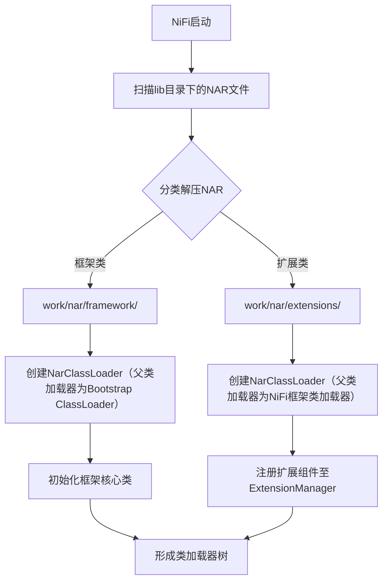

## 引言
在大数据处理领域，Apache NiFi凭借其强大的数据流管理和处理能力，成为了众多开发者和企业的首选工具之一。NAR（NiFi Archive）包通过**自定义类加载器**实现组件依赖的物理隔离，确保不同Processor、Controller Service等扩展组件使用的第三方库（如不同版本的Apache Commons）互不冲突。这一机制解决了传统Java应用因类路径污染导致的`NoClassDefFoundError`或`ClassCastException`问题，使得NiFi生态能够无缝集成社区贡献的数千个扩展组件。
。本文将深入剖析Apache NiFi的Nar包加载原理，并通过流程图和关键代码解读，帮助读者更好地理解和掌握这一机制。

## Nar包加载原理

### 流程图

_流程说明_：

- ​**解压分类**：框架NAR（如`nifi-framework-nar`）与扩展NAR分开存储，确保框架代码优先加载

- ​**类加载器树**：每个NAR对应独立的`NarClassLoader`，其父加载器为上层NAR或框架类加载器，形成树状委托链
    
### Nar包文件结构
```bash
META-INF/
├── MANIFEST.MF          # 包含Nar-Id、版本、依赖等元数据
├── bundled-dependencies/ # 组件及其依赖的JAR（如nifi-flume-processors.jar）
├── maven/               # Maven构建信息（pom.xml）
├── LICENSE
└── NOTICE
```

_关键特性_：

- ​**MANIFEST.MF**中`Nar-Dependency-Id`声明依赖的其他NAR包（仅支持单个直接依赖）
- `bundled-dependencies`目录内的JAR由NAR类加载器优先加载，实现依赖隔离

### 关键代码解读

#### RunNiFi类的main方法
```java
public static void main(String[] args) throws IOException, InterruptedException {
    ...
    switch (cmd.toLowerCase()) {
        case "start":
            runNiFi.start();
            break;
        case "run":
            runNiFi.start();
            break;
        ...
    }
    ...
}
```
在RunNiFi类的main方法中，根据传入的命令类型（如start或run），调用runNiFi.start()方法来启动NiFi进程。

#### runNiFi.start()方法
```java
public void start() throws IOException, InterruptedException {
    ...
    final ProcessBuilder builder = new ProcessBuilder();
    ...
    final String classPath = classPathBuilder.toString();
    String javaCmd = props.get("java");
    if (javaCmd == null) {
        javaCmd = DEFAULT_JAVA_CMD;
    }
    if (javaCmd.equals(DEFAULT_JAVA_CMD)) {
        String javaHome = System.getenv("JAVA_HOME");
        if (javaHome != null) {
            String fileExtension = isWindows() ? ".exe" : "";
            File javaFile = new File(javaHome + File.separatorChar + "bin"
                    + File.separatorChar + "java" + fileExtension);
            if (javaFile.exists() && javaFile.canExecute()) {
                javaCmd = javaFile.getAbsolutePath();
            }
        }
    }
    ...
    final List<String> cmd = new ArrayList<>();
    cmd.add(javaCmd);
    cmd.add("-classpath");
    cmd.add(classPath);
    cmd.addAll(javaAdditionalArgs);
    cmd.add("-Dnifi.properties.file.path=" + nifiPropsFilename);
    cmd.add("-Dnifi.bootstrap.listen.port=" + listenPort);
    cmd.add("-Dapp=NiFi");
    cmd.add("-Dorg.apache.nifi.bootstrap.config.log.dir=" + nifiLogDir);
    if (!System.getProperty("java.version").startsWith("1.")) {
        cmd.add("--add-modules=java.xml.bind");
    }
    cmd.add("org.apache.nifi.NiFi");
    ...
    builder.command(cmd);
    ...
    Process process = builder.start();
    ...
}
```
在runNiFi.start()方法中，构建了启动NiFi进程所需的命令和参数，包括Java命令、类路径、系统属性等，然后通过ProcessBuilder启动NiFi进程。

#### NiFi类的构造方法
```java
public NiFi(final NiFiProperties properties, ClassLoader rootClassLoader)
        throws ClassNotFoundException, IOException, NoSuchMethodException, InstantiationException, IllegalAccessException, IllegalArgumentException, InvocationTargetException {
    ...
    NarClassLoaders narClassLoaders = NarClassLoaders.getInstance();
    narClassLoaders.init(rootClassLoader,
            properties.getFrameworkWorkingDirectory(), properties.getExtensionsWorkingDirectory());
    ...
    final Set<Bundle> narBundles = narClassLoaders.getBundles();
    ...
}
```
在NiFi类的构造方法中，获取NarClassLoaders的单例实例，并调用其init方法进行初始化，为每个Nar包创建类加载器，并将它们有序存入一个Set中。

#### NarClassLoaders类的初始化方法
```java
public void init(ClassLoader rootClassLoader, File frameworkWorkingDirectory, File extensionsWorkingDirectory) {
    ...
    // 为每个Nar包创建类加载器
    for (File narFile : narFiles) {
        ...
        NarClassLoader narClassLoader = new NarClassLoader(narFile, rootClassLoader, extensionsWorkingDirectory);
        ...
        bundles.add(new Bundle(narClassLoader, narFile.getName()));
    }
    ...
}
```
在NarClassLoaders类的init方法中，遍历所有Nar包文件，为每个Nar包创建一个NarClassLoader实例，并将这些类加载器封装成Bundle对象，存入一个有序的Set集合中。

### Nar包加载原理深入讲解

#### 类加载器的创建与依赖关系
在NiFi中，每个Nar包都会被创建一个独立的类加载器，这些类加载器之间存在依赖关系。被依赖的Nar包的类加载器会作为依赖Nar包的父类加载器。这样，在加载类时，会先从父类加载器加载，再从自身加载，从而实现了类的隔离和依赖管理。

#### 类加载器的加载顺序
Nar包的加载顺序是按照依赖关系进行的，被依赖的Nar包会先于依赖它的Nar包被加载。这样可以确保在加载某个Nar包时，其依赖的类已经存在，避免了类找不到的问题。

#### 类资源的隔离
通过为每个Nar包创建独立的类加载器，NiFi实现了类资源的隔离。不同Nar包中的同名类不会相互干扰，每个Nar包只能访问自己及其依赖Nar包中的类，从而保证了系统的稳定性和安全性。


---

### **Apache NiFi NarClassLoader核心逻辑深度解析**

NAR（NiFi Archive）包的类加载机制是NiFi实现组件隔离的核心，其核心逻辑由**NarClassLoader**类实现。该加载器通过**自定义类路径扫描顺序**和**打破双亲委派模型**实现依赖隔离，同时确保NiFi框架类的一致性。以下从源码层面对其关键逻辑展开分析。

---

#### **1. 类加载器结构设计**
NarClassLoader继承自`URLClassLoader`，其构造函数初始化时会扫描NAR包的`bundled-dependencies`目录，将内部JAR文件添加到类路径：
```java
// 源码位置：NarClassLoader.java
public NarClassLoader(File narDirectory, ClassLoader parent) {
    super(new URL[0], parent); // 父类加载器为框架或上层NAR的ClassLoader
    File bundledDependencies = new File(narDirectory, "bundled-dependencies");
    if (bundledDependencies.exists()) {
        File[] jars = bundledDependencies.listFiles((dir, name) -> name.endsWith(".jar"));
        for (File jar : jars) {
            addURL(jar.toURI().toURL()); // 将JAR添加到当前类加载器的搜索路径
        }
    }
}
```
*关键点*：  
• **物理隔离**：每个NAR包的`bundled-dependencies`目录内的JAR仅对当前加载器可见，其他NAR无法访问。  
• **父加载器委托**：通过构造函数传入的`parent`参数形成类加载器树，确保框架类优先由父加载器加载。

---

#### **2. 打破双亲委派模型**
NarClassLoader重写`loadClass`方法，对NiFi自有包（如`org.apache.nifi.*`）优先从当前NAR加载，而非遵循标准的双亲委派：
```java
@Override
public Class<?> loadClass(String name) throws ClassNotFoundException {
    // 1. 优先从本地bundled-dependencies加载NiFi核心类
    if (name.startsWith("org.apache.nifi")) { 
        try {
            return findClass(name); // 本地查找
        } catch (ClassNotFoundException e) {
            // 本地未找到则委托父加载器
            return super.loadClass(name); 
        }
    }
    // 2. 非NiFi类按双亲委派加载
    return super.loadClass(name); 
}
```
*设计意义*：  
• **版本兼容性**：允许不同NAR包使用不同版本的NiFi API（如自定义Processor需兼容旧版框架）。  
• **隔离性**：第三方依赖（如Guava、Jackson）仅对当前NAR可见，避免全局污染。

---

#### **3. 依赖加载优先级**
NarClassLoader在资源查找时优先扫描本地JAR，其次委托父加载器：
```java
@Override
public URL getResource(String name) {
    // 1. 优先从当前NAR的bundled-dependencies查找
    URL url = findResource(name); 
    if (url != null) {
        return url;
    }
    // 2. 未找到则委托父加载器
    return super.getResource(name); 
}
```
*资源隔离*：  
• 配置文件（如`META-INF/services/org.apache.nifi.processor.Processor`）仅从当前NAR读取，确保组件注册不冲突。  
• 静态资源（如图标、XML模板）按NAR包隔离，支持同名文件多版本共存。

---

#### **4. 类加载器生命周期管理**
NAR包的加载与卸载通过`NarClassLoaders`类统一管理：
```java
// 源码位置：NarClassLoaders.java
public static void init(ClassLoader rootClassLoader, File frameworkDir, File extensionsDir) {
    // 加载框架NAR（父加载器为Bootstrap ClassLoader）
    loadNar(frameworkDir, rootClassLoader, FRAMEWORK_NAR_ID); 
    
    // 加载扩展NAR（父加载器为框架NAR的ClassLoader）
    File[] extensionNars = extensionsDir.listFiles();
    for (File nar : extensionNars) {
        loadNar(nar, frameworkClassLoader, EXTENSION_TYPE);
    }
}

private static void loadNar(File narDir, ClassLoader parent, String type) {
    // 创建NarClassLoader实例并缓存
    NarClassLoader narClassLoader = new NarClassLoader(narDir, parent);
    bundles.put(narId, new Bundle(narId, narClassLoader));
}
```
*生命周期控制*：  
• **热加载**：通过`NarClassLoaders.reload()`实现NAR包动态更新（需重启组件）。  
• **依赖树**：`Nar-Dependency-Id`在MANIFEST.MF中声明依赖关系，加载时自动构建类加载器树。

---

#### **5. 源码级设计哲学**
1. **隔离性优先**：通过物理目录隔离和类加载器树，避免“依赖地狱”（Dependency Hell）。  
2. **扩展性设计**：支持动态添加NAR包，无需重启NiFi服务（部分场景需刷新组件）。  
3. **性能优化**：采用懒加载机制，仅在首次调用`loadClass`时解析JAR，减少启动开销。

---

### **总结**
NarClassLoader通过**自定义类查找顺序**和**层级化父加载器委托**，在保证NiFi核心类一致性的同时实现组件级隔离。其源码设计体现了三个核心原则：**物理隔离决定类可见性**、**父委托保障框架稳定性**、**懒加载优化资源开销**。开发者自定义NAR包时，需严格遵循`bundled-dependencies`目录规范，并合理声明`Nar-Dependency-Id`以避免循环依赖。

## 基于Nar包加载机制自定义Nar包

### 创建自定义Nar包的步骤

1. **创建Maven项目**：使用Maven创建一个新的项目，并在pom.xml文件中配置NiFi的相关依赖和插件。
2. **编写自定义代码**：根据需求编写自定义的Processor、ControllerService或ReportingTask等组件代码。
3. **配置Nar打包插件**：在pom.xml中配置NiFi的Nar打包插件，指定Nar包的类型和依赖关系。
4. **打包生成Nar包**：使用Maven的package命令打包项目，生成自定义的Nar包。
5. **部署Nar包**：将生成的Nar包放置到NiFi的lib目录下，NiFi在启动时会自动加载该Nar包。

### 示例代码

以下是一个简单的自定义Processor示例：

```java
@Tags({"example"})
@CapabilityDescription("An example processor for demonstration purposes.")
public class ExampleProcessor extends AbstractProcessor {

    @Override
    public void onTrigger(ProcessContext context, ProcessSessionFactory sessionFactory) throws ProcessException {
        ProcessSession session = sessionFactory.createSession();
        FlowFile flowFile = session.get();
        if (flowFile != null) {
            // 处理FlowFile的逻辑
            session.transfer(flowFile, REL_SUCCESS);
        }
    }
}
```

在pom.xml中配置Nar打包插件：

```xml
<build>
    <plugins>
        <plugin>
            <groupId>org.apache.nifi</groupId>
            <artifactId>nifi-nar-maven-plugin</artifactId>
            <version>1.17.0</version>
            <extensions>true</extensions>
            <configuration>
                <narType>nar</narType>
                <classifier>nar</classifier>
            </configuration>
        </plugin>
    </plugins>
</build>
```

通过以上步骤和示例代码，用户可以基于NiFi的Nar包加载机制，轻松地创建和部署自定义的Nar包，从而扩展NiFi的功能，满足特定的业务需求。

## 总结
本文详细解析了Apache NiFi的Nar包加载原理，通过流程图和关键代码解读，使读者对NiFi的Nar包加载过程有了清晰的认识。同时，本文还提供了基于Nar包加载机制自定义Nar包的步骤和示例代码，帮助读者快速上手NiFi的自定义扩展开发。希望本文能为NiFi的使用者和开发者提供有价值的参考和帮助。