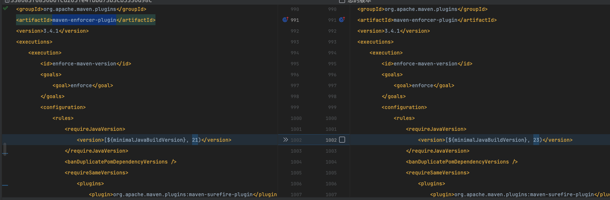
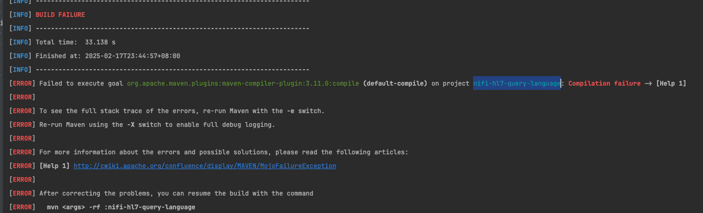
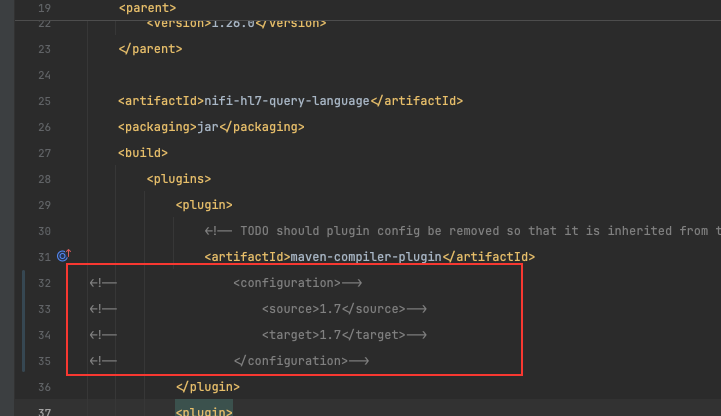
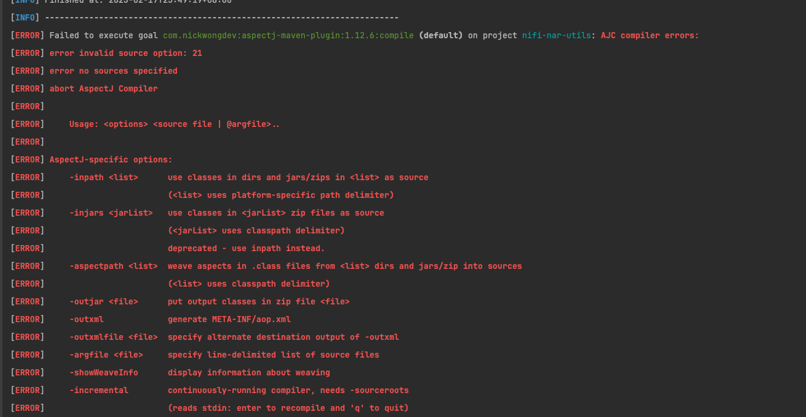
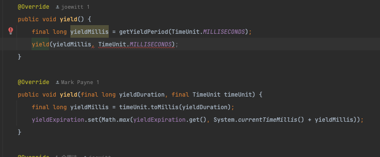
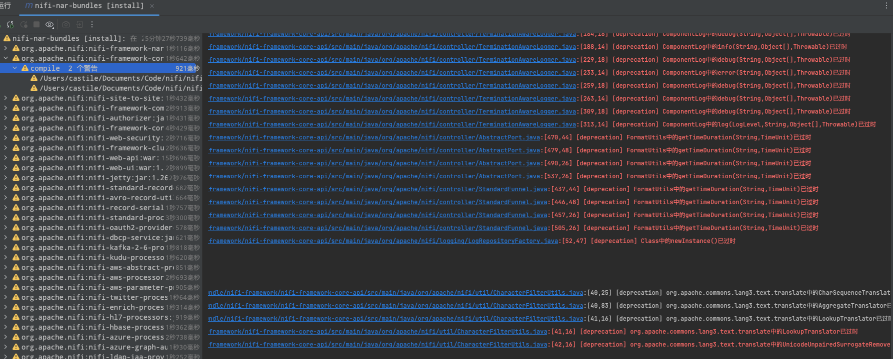

1、 修改支持的JDK范围
maven-enforcer-plugin

2、Failed to execute goal org.apache.maven.plugins:maven-compiler-plugin:3.11.0:compile (default-compile) on project nifi-hl7-query-language: Compilation failure ->

注释掉下面的配置

3、Failed to execute goal com.nickwongdev:aspectj-maven-plugin:1.12.6:compile (default) on project nifi-nar-utils: AJC compiler errors:

参考： https://dev-aspectj.github.io/aspectj-maven-plugin/index.html
升级aspectjtools版本为1.9.21+

4、nifi-framework-core-api：错误: 受限标识符 'yield' 的用法无效

`yield` 是 Java 13 引入的一个关键字，用于在 `switch` 表达式中返回值。它在 JDK 14 中正式成为标准特性（JEP 361: Switch Expressions），并且在 JDK 21 中仍然有效。
这里是被识别成关键字了，修改成this.yield调用方法即可

5、 很多过时的API

结论： NiFi1.26版本可以使用JDK21 编译成功，只需要简单几处修改即可，但是功能暂时未验证OK。