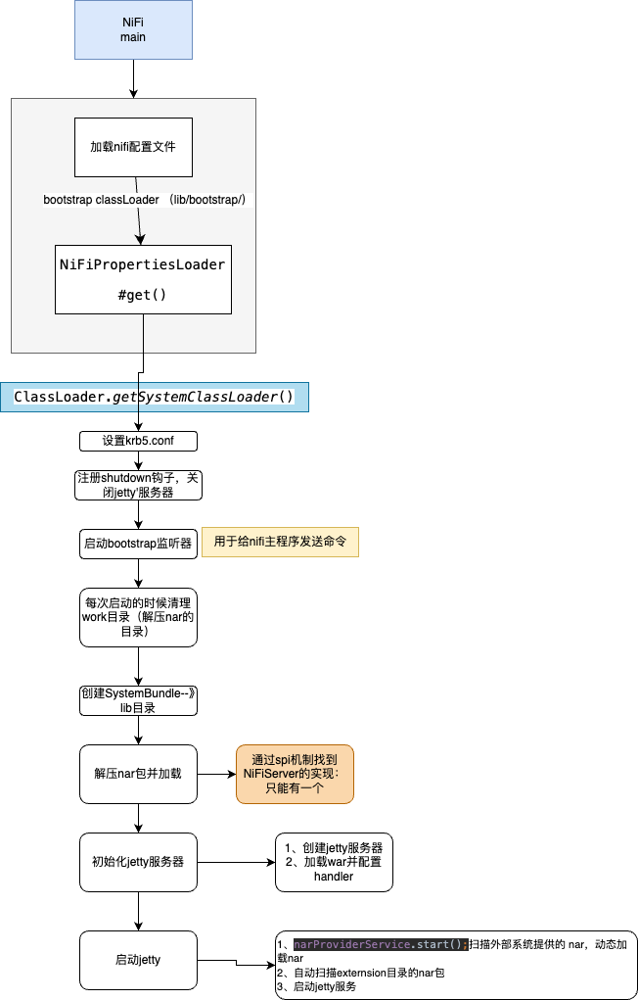
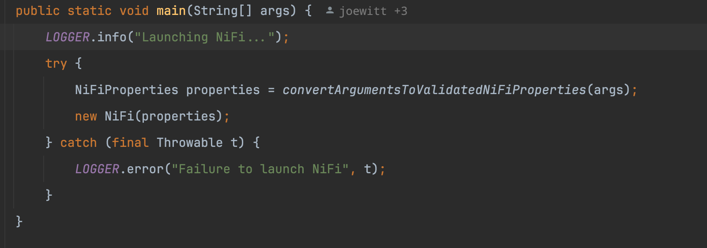

# 0 整体概览



# 1、入口
入口类是org.apache.nifi.NiFi， 这个类包含一个主函数：

两个步骤：
1、 加载NiFi的配置文件
2、创建一个NiFi对象，将配置文件传入
加下来分别讲一下

# 1、  加载NiFi配置文件
加载配置文件同样在NiFi这个类本身的
```java
protected static NiFiProperties convertArgumentsToValidatedNiFiProperties(String[] args) {  
    return convertArgumentsToValidatedNiFiProperties(args, createBootstrapClassLoader());  
}
```
这里注意第二个参数，创建了一个启动类加载器：

创建了一个URLClassLoader，把lib/bootstrap目录下的jar加载进来。那么这个目录下有哪些jar呢？


# 2、 启动
在NiFi的构造函数中做了一系列的操作
1、nifi配置文件设置了大量的配置，用于控制程序应该如何启动
2、使用系统类加载器加载lib目录的nar包
3、配置krb5文件
4、初始化jetty服务器，加载war包用于前端页面展示
5、扫描外部系统如hdfs提供的nar，自动扫描extensions目录下的nar，支持动态加载
6、启动jetty服务器让那个程序运行
7、在集群环境下，由于FlowService load 数据流的时候会去访问api接口，此时如果应用程序没有完成初始化是会失败的，因此这里做了一些特殊判断：
-  集群环境： 在jetty应用程序完全启动好了去初始化FLow
- 非集群环境通过context listener监听ContextInitialized Servlet事件去初始化flow
下面是源码的注释解释：
org.apache.nifi.web.contextlistener.ApplicationStartupContextListener#contextInitialized：


